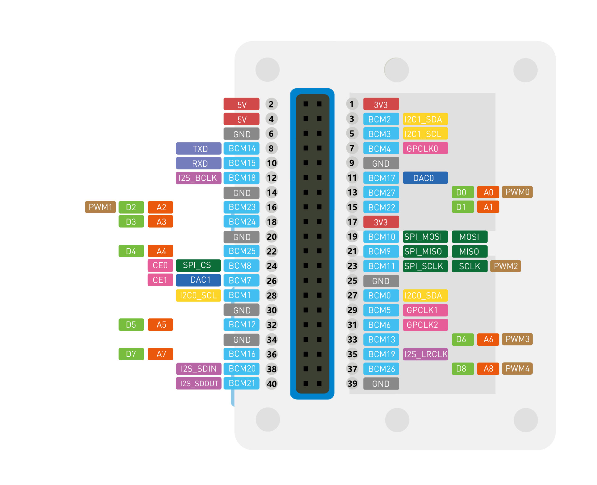
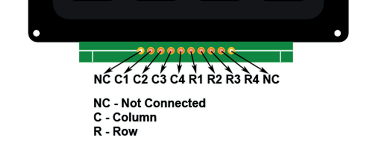

# escape-room
Side notes about a tentative Mesh baased Escape Room

C1 --> BCM26 
C2 --> BCM19
C3 --> BCM13
C4 --> BCM6
R1 --> BCM5
R2 --> BCM0
R3 --> BCM11
R4 --> BCM9

CLi notes

meshtastic --port COM26 --ch-index 0 --ch-set name escape-room

meshtastic --port COM26 --ch-index 0 --ch-set psk supersecretkey

🔁 Vuoi clonare questa configurazione su altre radio?
Puoi farlo così:

Esporta la config attuale:

bash
Copia
Modifica
meshtastic --port COM26 --export-config > escape-room-config.json
Caricala su un altro nodo (es. COM42):

bash
Copia
Modifica
meshtastic --port COM42 --configure escape-room-config.json

